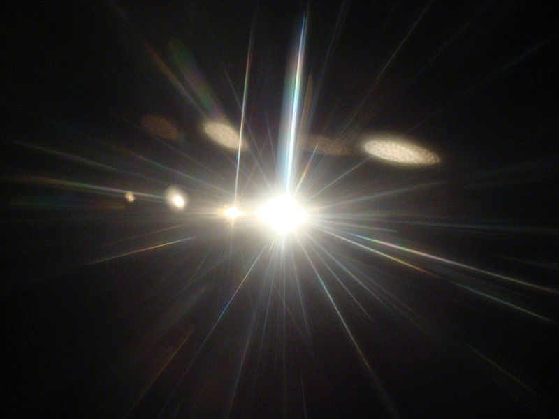

# END1 - The Light in the Dark
---
  
Picture by Zouavman Le Zouave in https://commons.wikimedia.org/wiki/File:Light_shining2.JPG

You stand on the stage, eyes blurred with tear, feeling numb and helpless. Your tear arouse people's attention, and someone in front walk up to the stage, still and confident. His vioce is clear compared to the chaos of the crowd, "I'm volunteer to be the tribute and I will join the Hunger Game". You stand still, starled of what you just heard. You were saved, from a stranger, who might be forgotten in the river of time. However, to you, he is the light in the dark.

[Start Over](../situations/casting-ceremony.md)