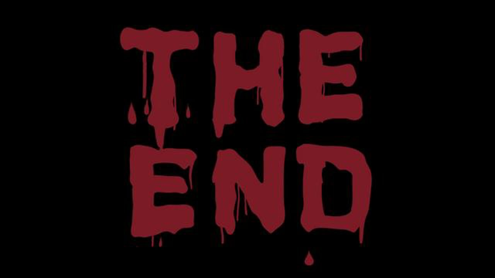

END3 - White Bones
---
  
Picture by Thebobwolf in https://vimeo.com/16028652

You listened to his commands, and helped him solved the danger on the way. When you decided to take a rest, something sharp stab in your back, and you know it's too late for escape, and your Game will be end here. You will be forgotten soon, and the white bone will be the only indication that you were part of the Hunger Game...

[Start Over](../situations/casting-ceremony.md)